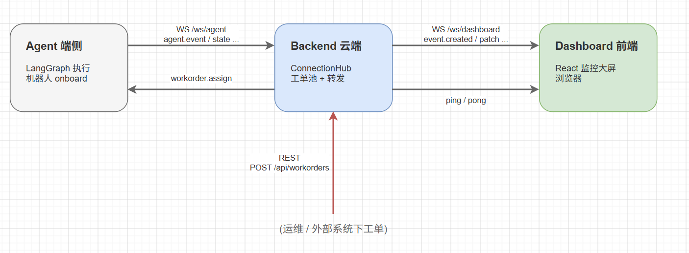

# TrayBot 三方通信架构

本文档描述 **Agent（端侧）**、**Backend（云端）**、**Dashboard（前端）** 三端的连接方式、消息约定与完整交互流程。

> 协议源码：`shared/traybot_protocol/`  
> 可视化时序图：`exchange.xml`（可用 draw.io 打开）

---

## 1. 架构总览

TrayBot 采用**端云分离 + 混合传输**架构：Agent 与 Dashboard **不直连**，所有实时数据经 Backend 中转。

```
Dashboard ──WebSocket /ws/dashboard──▶ Backend ──MQTT──▶ Agent
REST POST /api/workorders ──────────▶ Backend
```

- **Agent ↔ Backend**：默认 **MQTT**（Topic 对齐异构多机平台）；Legacy 可回退 `WS /ws/agent`
- **Dashboard ↔ Backend**：**WebSocket**（浏览器不直连 MQTT）
- **工单创建**：REST，不经过 Agent



### 1.1 各端职责

| 组件 | 部署位置 | 核心职责 |
|------|----------|----------|
| **Agent** | 机器人 onboard | 执行 LangGraph 工作流；生成步骤事件与 Thinking；上报机器人/地图状态；等待并接受工单分派 |
| **Backend** | 云服务器 | 工单队列权威源；MQTT Bridge（Agent）；Dashboard WebSocket Hub；Agent ↔ Dashboard 消息转发 |
| **Dashboard** | 浏览器 | 连接 Backend WebSocket；展示工单池、图文直播、地图导航、本体状态；**不**直接与 Agent 通信 |

### 1.2 设计原则

1. **Backend 是唯一中枢**：Dashboard 只订阅 Backend；Agent 只上报 Backend（经 MQTT 或 Legacy WS）。
2. **工单权威在 Backend**：工单创建、排队、状态变更由 `WorkOrderStore` 管理；Agent 只执行被分派的工单。
3. **全局单工单执行**：同一时刻最多 1 条 `in_progress` 工单；同一时刻仅 1 个 Agent 实例在线（文件锁 + Hub 执行锁）。
4. **协议共享**：Agent 与 Backend 共用 `shared/traybot_protocol` 包；MQTT 与 WebSocket 使用相同 `{ action, payload }` Envelope。
5. **混合传输**：Agent 链路默认 MQTT；Dashboard 链路始终 WebSocket；Payload 语义不因传输层改变。

---

## 2. 连接端点

### 2.1 MQTT（Agent ↔ Backend，默认）

对齐异构多机平台 Topic 约定，Payload 仍为 `{ action, payload }` Envelope（与 WebSocket 一致）。

| Topic | 方向 | 说明 |
|-------|------|------|
| `thing/product/traybot/{robotId}/osd` | Agent → Backend | 事件、Thinking、状态、工单进度 |
| `thing/product/traybot/{robotId}/service` | Backend → Agent | 工单分派、ping |

**默认联调**：

| 端 | 配置 |
|----|------|
| Agent | `python -m app.main run-cloud`（默认 `--transport mqtt`，Broker `127.0.0.1:1883`） |
| Backend | `./run_server.sh`；lifespan 启动 MQTT Bridge（`TRAYBOT_MQTT_ENABLED=true`） |

**Backend 环境变量**：

| 变量 | 默认 | 说明 |
|------|------|------|
| `TRAYBOT_MQTT_ENABLED` | `true` | 是否启动 MQTT Bridge |
| `TRAYBOT_MQTT_BROKER` | `127.0.0.1` | Broker 地址 |
| `TRAYBOT_MQTT_PORT` | `1883` | Broker 端口 |

**Agent CLI**（MQTT 相关）：

| 参数 | 默认 | 说明 |
|------|------|------|
| `--transport` | `mqtt` | `ws` 为 Legacy WebSocket |
| `--mqtt-broker` | `127.0.0.1` | |
| `--mqtt-port` | `1883` | |
| `--robot-id` | `TrayBot-01` | 对应 Topic 中的 `{robotId}` |
| `--cloud-url` | `ws://127.0.0.1:8000/ws/agent` | 仅 `--transport ws` |

Broker 部署见 [mqtt.md](./mqtt.md)。

源码：`shared/traybot_protocol/mqtt_topics.py`、`agent/app/mqtt_reporter.py`、`backend/app/mqtt_bridge.py`

### 2.2 WebSocket

| 路径 | 方向 | 说明 |
|------|------|------|
| `WS /ws/agent` | Agent → Backend | **Legacy**；`--transport ws` 时使用 |
| `WS /ws/dashboard` | Dashboard → Backend | 前端订阅；Backend 推送实时更新 |

**默认地址（联调）**：

| 端 | 地址 |
|----|------|
| Agent（Legacy） | `ws://127.0.0.1:8000/ws/agent` |
| Dashboard | `ws://localhost:5173/ws/dashboard`（Vite 代理至 Backend `:8000`） |

Dashboard 也可通过环境变量 `VITE_WS_URL` 直接指定 Backend 地址。

### 2.3 REST（不经过 Agent）

| 方法 | 路径 | 说明 |
|------|------|------|
| `GET` | `/health` | 健康检查（见下表） |
| `GET` | `/api/workorders` | 查询工单列表 |
| `POST` | `/api/workorders` | 创建工单（可能触发分派 Agent） |

**`GET /health` 响应字段**：

| 字段 | 说明 |
|------|------|
| `agent_connected` | Agent 是否在线（MQTT 或 Legacy WS 任一即可） |
| `agent_mqtt_connected` | 是否有 MQTT Agent 注册（`_mqtt_robots` 非空） |
| `agent_ws_connected` | Legacy `/ws/agent` 是否连接 |
| `mqtt_bridge_connected` | Backend MQTT Bridge 是否已连 Broker |
| `dashboard_clients` | 当前 Dashboard WebSocket 客户端数 |

---

## 3. 消息 Envelope 约定

Agent、Backend、Dashboard 之间的业务消息统一采用 JSON Envelope（**MQTT payload 与 WebSocket 帧相同**）：

```json
{
  "action": "<action 字符串>",
  "payload": { }
}
```

- `action`：消息类型，见下文各 action 表。
- `payload`：业务数据，字段命名采用 **camelCase**（与前端 JSON 一致）。

**源码定义**：`shared/traybot_protocol/messages.py`

| 枚举类 | 方向 |
|--------|------|
| `AgentAction` | Agent → Backend |
| `DashboardAction` | Backend → Dashboard |
| `CloudToAgentAction` | Backend → Agent |

---

## 4. 消息转发对照表

Backend `ConnectionHub`（`backend/app/hub.py`）负责接收 Agent 消息（经 **MqttBridge** 或 Legacy `/ws/agent`）并转换为 Dashboard WebSocket 广播。

**Agent 消息入口**：MQTT 时 `mqtt_bridge.py` 订阅 `thing/product/traybot/+/osd` → `handle_agent_message()`；Legacy 时 `/ws/agent` 直接调用同一方法。

### 4.1 Agent → Backend → Dashboard

| Agent action | Dashboard action | 说明 |
|--------------|------------------|------|
| `agent.hello` | — | Agent 注册，Backend 记录 robotId，不转发 |
| `agent.event` | `event.created` | 步骤事件；`visible=false` 时不写入 feed、不广播 |
| `agent.thinking.delta` | `event.thinking.delta` | Thinking 逐字增量；payload 含完整 `thinking` 字段 |
| `agent.thinking.done` | `event.thinking.done` | Thinking 结束 |
| `agent.state` | `state.patch` | 机器人 / 地图状态增量 |
| `agent.workorder.progress` | `workorder.updated` | 工单进度更新 |
| `agent.workorder.done` | `workorder.completed` + `feed.clear` + 可能 `workorder.started` | 工单完成；清空直播；自动启动下一单 |

### 4.2 Backend → Agent

| action | 触发时机 |
|--------|----------|
| `workorder.assign` | 新建首单 / 上一单完成 / Agent 上线且仍有执行中工单 |
| `ping` | Backend 心跳（可选；Agent 回复 `pong`） |

下发路径：MQTT 时 publish 到 `thing/product/traybot/{robotId}/service`；Legacy 时经 `/ws/agent` 发送。Hub 优先 MQTT（`_send_agent`）。

### 4.3 Backend → Dashboard（非 Agent 触发）

| action | 触发时机 |
|--------|----------|
| `snapshot` | Dashboard WebSocket 连接成功时立即推送 |
| `workorder.created` | POST 工单时当前有进行中工单，新单排队 |
| `workorder.started` | POST 首单或上一单完成后下一单开始 |
| `pong` | 响应 Dashboard 的 `ping` |

### 4.4 Dashboard → Backend

| action | 说明 |
|--------|------|
| `ping` | 心跳 |

Dashboard **不向 Agent 发送任何消息**。

---

## 5. 连接生命周期

### 5.1 Dashboard 连接

```
Dashboard                    Backend
    │                           │
    │── WS connect /ws/dashboard ─▶│
    │◀── snapshot ───────────────│  { liveEvents, workOrders, robotStatus, mapState }
    │                           │
    │── ping（可选）─────────────▶│
    │◀── pong ───────────────────│
```

- 前端使用**全局单例** WebSocket 客户端（`useDashboardSocket.ts`），避免 StrictMode 双连接。
- 断线后 **3 秒**自动重连；重连后再次收到 `snapshot`。

### 5.2 Agent 连接（MQTT，默认）

```
Agent              MQTT Broker           Backend (MqttBridge)
  │                     │                        │
  │── connect ─────────▶│                        │
  │── subscribe service │                        │
  │── publish osd: hello ────────────────────────▶│  parse topic → robotId
  │                     │                        │  handle_agent_message(hello)
  │                     │                        │  _on_agent_online()
  │◀── publish service: workorder.assign ────────│  （若有 in_progress 工单）
  │                     │                        │
  │  … publish osd: event / thinking.* / state … │
```

**MQTT 侧行为**（`mqtt_reporter.py` + `hub.py`）：

- Agent 连接 Broker，订阅 `thing/product/traybot/{robotId}/service`，向 `osd` topic 发布消息
- Backend `MqttBridge` 订阅 `thing/product/traybot/+/osd`，解析 `{robotId}` 后交给 Hub
- `agent.hello` 将 `robotId` 写入 `_mqtt_robots`，设置 `_primary_robot_id`，触发工单分派
- Agent 重连后再次 `hello` → 若 `_executing_order_id` 仍在执行，重新 `workorder.assign`
- Agent 进程单实例：文件锁 `/tmp/traybot-agent.lock`

### 5.3 Agent 连接（Legacy WebSocket）

```
Agent                        Backend
    │                           │
    │── WS connect /ws/agent ───▶│
    │── agent.hello ───────────▶│  { robotId, version }
    │                           │
    │◀── workorder.assign ──────│  （若有 in_progress 工单）
    │                           │
    │  … 执行工作流，持续上报 …    │
```

**Legacy WebSocket 侧行为**（`reporter.py` + `hub.py`）：

- 同时只允许 **1 个** `/ws/agent` 连接；新连接会 close 旧连接（code `4000`）
- 重连逻辑与 MQTT 相同：执行中工单会重新 `workorder.assign`
- 启动命令：`python -m app.main run-cloud --transport ws`

**Hub 下发优先级**（`_send_agent`）：若 MQTT Bridge 已连接 → publish `service` topic；否则走 `agent_ws`。

---

## 6. 工单生命周期

### 6.1 创建与分派

```bash
curl -X POST http://127.0.0.1:8000/api/workorders \
  -H 'Content-Type: application/json' \
  -d '{
    "id": "WO-20260629-001",
    "totalTrays": 25,
    "pickup": "取料货架 A-01",
    "delivery": "送料货架 B-09",
    "backpackCapacity": 20
  }'
```

**排队规则**（Backend + Dashboard 一致）：

| 规则 | 说明 |
|------|------|
| 初始为空 | 工单池不预置数据 |
| 首单自动执行 | 无 `in_progress` 时，新工单升为 `in_progress` |
| 后续排队 | 有进行中工单时，新工单为 `pending` |
| 全局唯一进行中 | 同时最多 1 条 `in_progress` |
| FIFO | 完成后下一条 `pending` 自动升为 `in_progress` |

**分派 payload**（`workorder.assign`）：

```json
{
  "id": "WO-20260629-001",
  "totalTrays": 25,
  "deliveredTrays": 0,
  "pickup": "取料货架 A-01",
  "delivery": "送料货架 B-09",
  "backpackCapacity": 20
}
```

### 6.2 执行与完成

```
1. Backend ──workorder.assign──▶ Agent   （MQTT service / Legacy WS）
2. Agent 执行 LangGraph 工作流，逐步上报 agent.event / agent.state  （MQTT osd / Legacy WS）
3. 放架成功时 ──agent.workorder.progress──▶ Backend ──workorder.updated──▶ Dashboard（WS）
4. 全部批次送完 ──agent.workorder.done──▶ Backend
5. Backend ──workorder.completed──▶ Dashboard
6. Backend ──feed.clear──▶ Dashboard（清空图文直播）
7. 若有排队 ──workorder.started──▶ Dashboard + workorder.assign ──▶ Agent
```

Agent 支持**多批次**循环：若 `totalTrays > backpackCapacity`，送完一批后 `batch_decision` 决策继续取料，直至全部送达才 `return_home` 并 `workorder.done`。

---

## 7. 图文直播（LiveEvent）

### 7.1 数据模型

```typescript
interface LiveEvent {
  id: string
  type: LiveEventType
  title: string
  description?: string
  thinking?: string
  activeRoute?: 'home-pickup' | 'pickup-delivery' | 'delivery-home' | 'delivery-pickup'
  timestamp: string   // ISO8601
  visible?: boolean   // 默认 true
}
```

**事件类型**（`LiveEventType`）：

| type | 含义 |
|------|------|
| `order_received` | 收到工单（`visible=false`，不进 feed） |
| `nav_to_pickup` | 前往取料货架 |
| `arrived_pickup` | 抵达取料货架 |
| `target_locked` | 目标盘已锁定 |
| `grab_success` | 抓取成功 |
| `put_backpack` | 入包 |
| `nav_to_delivery` | 前往送料货架 |
| `arrived_delivery` | 抵达送料货架 |
| `taking_out` | 从背包取出 |
| `put_shelf_success` | 放架成功 |
| `batch_decision` | 批次决策（继续取料 / 返回 HOME） |
| `return_home` | 返回 HOME |

### 7.2 普通事件推送

Agent 每完成一个步骤：

```json
// Agent → Backend
{
  "action": "agent.event",
  "payload": {
    "id": "evt-abc123",
    "type": "grab_success",
    "title": "抓取成功",
    "description": "夹爪抓取完成，本轮 20 盘已稳定",
    "activeRoute": null,
    "timestamp": "2026-06-29T10:23:45.000Z",
    "visible": true,
    "taskId": "WO-20260629-001"
  }
}
```

Backend 转发（去掉 `taskId`）：

```json
{
  "action": "event.created",
  "payload": {
    "id": "evt-abc123",
    "type": "grab_success",
    "title": "抓取成功",
    "description": "夹爪抓取完成，本轮 20 盘已稳定",
    "timestamp": "2026-06-29T10:23:45.000Z",
    "visible": true
  }
}
```

Dashboard 处理：按 `id` 去重追加到 `liveEvents`，保留最近 **40** 条，自动滚到底部。

### 7.3 Thinking 流式推送

Thinking 内容**不在** `agent.event` 中携带全文，而是分帧推送（MQTT 与 Legacy WS 逻辑相同，详见 [thinking_delta_impl.md](./thinking_delta_impl.md)）：

```
1. agent.event          → event.created     （事件骨架，无 thinking）
2. agent.thinking.delta → event.thinking.delta  × N（0.04s/字，经 MQTT osd 或 WS）
3. agent.thinking.done  → event.thinking.done
```

**带 Thinking 的节点**（`THINKING_NODES`）：`order_received`、`arrived_pickup`、`batch_decision`。

**delta 帧示例**：

```json
{
  "action": "event.thinking.delta",
  "payload": {
    "eventId": "evt-abc123",
    "delta": "定",
    "thinking": "定"
  }
}
```

Backend 在服务端累积 `_pending_thinking`，每帧附带**完整** `thinking` 字段，避免前端重复追加。

Dashboard 联调模式（`VITE_USE_MOCK=false`）：直接用 payload 中的 `thinking` **替换**展示，不做本地打字机动画。

---

## 8. 机器人与地图状态

Agent 通过 `agent.state` 上报（MQTT `osd` 或 Legacy WS），Backend 转发为 Dashboard WebSocket 的 `state.patch`：

```json
{
  "action": "state.patch",
  "payload": {
    "robot": {
      "mode": "navigating",
      "speed": 0.35,
      "taskId": "WO-20260629-001"
    },
    "map": {
      "robotPos": { "x": 120, "y": 80 },
      "currentStepTitle": "正在前往取料货架",
      "activeRoute": "home-pickup"
    }
  }
}
```

**地图路线**（`activeRoute`）：

| 值 | 含义 |
|----|------|
| `home-pickup` | HOME → 取料货架（首批） |
| `pickup-delivery` | 取料 → 送料 |
| `delivery-pickup` | 送料 → 取料（后续批次） |
| `delivery-home` | 送料 → HOME（全部完成） |
| `null` | 无导航 |

导航步骤中 Agent 以 **20 帧 / 7s** 高频推送 `robotPos` 插值，Dashboard 地图实时更新。

**地标坐标**（Agent 与 Dashboard 对齐）：

| 点 | 坐标 (x, y) |
|----|-------------|
| HOME | (80, 320) |
| 取料货架 | (200, 80) |
| 送料货架 | (520, 80) |

---

## 9. 连接快照（snapshot）

Dashboard 连接成功后 Backend 立即推送当前全量状态：

```json
{
  "action": "snapshot",
  "payload": {
    "liveEvents": [],
    "workOrders": [],
    "robotStatus": {
      "name": "TrayBot-01",
      "mode": "idle",
      "battery": 78,
      "joints": [ ... ],
      ...
    },
    "mapState": {
      "robotPos": { "x": 80, "y": 320 },
      "currentStepTitle": "",
      "activeRoute": null
    }
  }
}
```

---

## 10. 完整业务时序

```
运维    Backend        Dashboard       MQTT Broker        Agent
 │         │               │                │               │
 │─POST───▶│               │                │               │
 │         │─workorder.started─────────────▶│               │
 │         │─publish service: assign ──────▶│──────────────▶│
 │         │               │                │               │
 │         │               │         ┌─ LangGraph 逐步执行 ─┐
 │         │◀─ osd: event ─────────────────────────────────│
 │         │─event.created────────────▶│                    │
 │         │◀─ osd: thinking.delta ─────────────────────────│
 │         │─thinking.delta───────────▶│                    │
 │         │◀─ osd: state ──────────────────────────────────│
 │         │─state.patch──────────────▶│         └──────────┘
 │         │               │                │               │
 │         │◀─ osd: workorder.done ─────────────────────────│
 │         │─workorder.completed──────▶│                    │
 │         │─feed.clear─────────────────▶│                    │
 │         │─workorder.started（下一单）──▶│                    │
 │         │─publish service: assign ──────▶│──────────────▶│
```

Legacy WebSocket 模式下，Agent 与 Backend 之间改为 `/ws/agent` 直连，Dashboard 侧时序不变。

---

## 11. Dashboard 消费约定

**源码**：`front/src/hooks/useDashboardSocket.ts`

| 行为 | 实现 |
|------|------|
| WebSocket 单例 | 模块级 `DashboardSocketClient`，`subscribe()` 时清除旧 handler |
| 事件去重 | 按 `event.id` 去重 |
| 断线重连 | 3s 后自动重连 |
| 未连接降级 | robot `mode` 显示为 `idle` |
| Thinking | 联调模式直接渲染 `thinking` 全文 |
| 工单队列 | `normalizeWorkOrderQueue()` 保证仅 1 条 `in_progress` |
| 直播清空 | 收到 `feed.clear` 或 `workorder.started` 时清空 `liveEvents` |

**Mock 模式**（`VITE_USE_MOCK=true`）：Dashboard 不连 Backend，使用 `useMockDashboard` 本地假数据，与 Agent 无关。

---

## 12. Agent 上报约定

**源码**：`agent/app/mqtt_reporter.py`（默认）、`agent/app/reporter.py`（Legacy）、`agent/app/runner.py`

`runner.create_reporter()` 按 `--transport` 选择 `MqttCloudReporter` 或 `CloudReporter`；对外 API 一致。

| 行为 | 实现 |
|------|------|
| 连接 | MQTT：`connect()` → 连 Broker、订阅 `service`、publish `osd: agent.hello`；WS：`CloudReporter.connect()` |
| 事件 | `publish_event()` → `agent.event` + 逐字 `thinking.delta`（0.04s/字）+ `thinking.done` |
| 状态 | `publish_state()` → `agent.state` |
| 进度 | `publish_workorder_progress()` → `agent.workorder.progress` |
| 完成 | `publish_workorder_done()` → `agent.workorder.done` |
| 等待工单 | MQTT：订阅 `service` 收 `workorder.assign` 入队；WS：阻塞 `ws.recv()` |
| 单实例 | 文件锁 `/tmp/traybot-agent.lock` |

---

## 13. Backend 运行时状态

**源码**：`backend/app/state.py`、`backend/app/work_orders.py`、`backend/app/hub.py`、`backend/app/mqtt_bridge.py`

| 组件 | 职责 |
|------|------|
| `WorkOrderStore` | 工单池 CRUD、排队、`complete()` 自动启动下一单 |
| `DashboardState` | `live_events`（最多 40 条）、`robot`、`map_state` |
| `MqttBridge` | 连 Broker；订阅 `+/osd`；publish `service`；转发至 Hub |
| `ConnectionHub` | Dashboard WS + Agent（MQTT/WS）连接管理、消息路由、`_executing_order_id` 执行锁、`_pending_thinking` 累积 |

---

## 14. 关键源文件索引

| 文件 | 职责 |
|------|------|
| `shared/traybot_protocol/messages.py` | action 常量定义 |
| `shared/traybot_protocol/models.py` | LiveEvent、WorkOrder、`THINKING_NODES` |
| `shared/traybot_protocol/mqtt_topics.py` | MQTT Topic 约定 |
| `agent/app/mqtt_reporter.py` | Agent MQTT 客户端（默认） |
| `agent/app/reporter.py` | Agent Legacy WebSocket 客户端 |
| `agent/app/runner.py` | 工作流逐步执行 + reporter 选择 |
| `agent/app/map_state.py` | 事件 → 地图状态映射 |
| `backend/app/mqtt_bridge.py` | MQTT Bridge |
| `backend/app/hub.py` | ConnectionHub 转发中枢 |
| `backend/app/server.py` | FastAPI 入口 + lifespan MQTT + REST + WS 路由 |
| `backend/app/work_orders.py` | 工单池 |
| `front/src/hooks/useDashboardSocket.ts` | Dashboard WebSocket 消费 |
| `front/src/hooks/useDashboard.ts` | Mock / 联调模式切换 |
| `front/src/types/index.ts` | 前端类型定义 |
| `doc/thinking_delta_impl.md` | Thinking delta 实现原理 |
| `doc/mqtt.md` | MQTT Broker 部署与联调 |

---

## 15. 不在实时协议范围内的能力

以下能力**不走** Agent ↔ Backend MQTT/WS 或 Dashboard WebSocket 协议：

| 能力 | 当前实现 |
|------|----------|
| 摄像头直播 | 本地 MP4 循环（`front/public/videos/`） |
| 移动控制面板 | Dashboard 本地 UI，未接 Backend |
| 工单持久化 | 内存存储，重启丢失 |
| 图文直播历史归档 | 工单完成后 `feed.clear` 清空，未持久化 |

---

## 16. 联调快速参考

**前置**：启动 MQTT Broker（见 [mqtt.md](./mqtt.md)）：

```bash
docker run -d --name traybot-mqtt -p 1883:1883 eclipse-mosquitto:2
```

```bash
# 终端 1 — Backend（默认启用 MQTT Bridge）
cd backend && ./run_server.sh

# 终端 2 — Dashboard
cd front && npm run dev

# 终端 3 — Agent（默认 MQTT）
cd agent && python -m app.main run-cloud

# 健康检查
curl http://127.0.0.1:8000/health
# 期望：mqtt_bridge_connected=true，agent_connected=true（Agent 启动后）

# 下工单
curl -X POST http://127.0.0.1:8000/api/workorders \
  -H 'Content-Type: application/json' \
  -d '{"id":"WO-001","totalTrays":25,"pickup":"取料货架 A-01","delivery":"送料货架 B-09","backpackCapacity":20}'
```

确保 `front/.env.development` 中 `VITE_USE_MOCK=false`。

**Legacy WebSocket 回退**（无 Broker）：

```bash
TRAYBOT_MQTT_ENABLED=false ./run_server.sh          # Backend
python -m app.main run-cloud --transport ws         # Agent
```

**常见问题**：

| 现象 | 处理 |
|------|------|
| `agent_connected: false` | 确认 Broker 运行；Agent 已 `run-cloud`；查 `/health` |
| Backend MQTT 启动失败 | Broker 未就绪；或设 `TRAYBOT_MQTT_ENABLED=false` 用 WS |
| Dashboard 无事件 | 与 MQTT 无关；确认 Backend :8000、Agent 在线、`VITE_USE_MOCK=false` |
| 工单不分派 | Agent 需先发 `agent.hello`；`robotId` 与 Topic 一致 |
